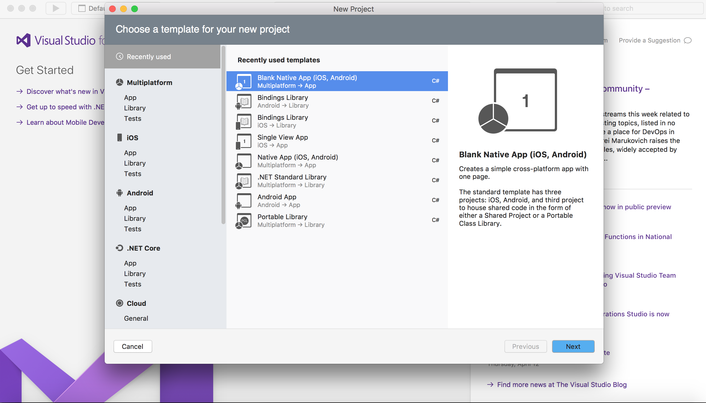
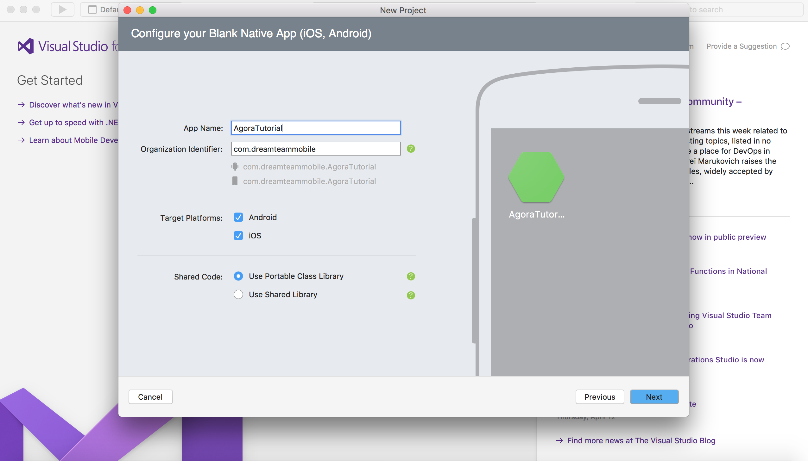
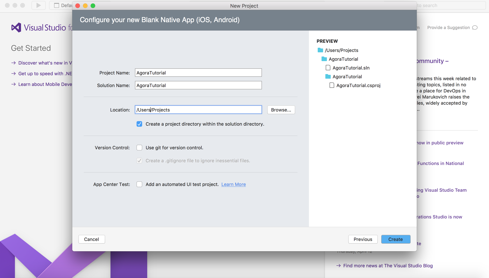
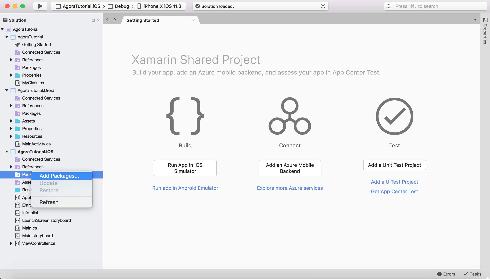
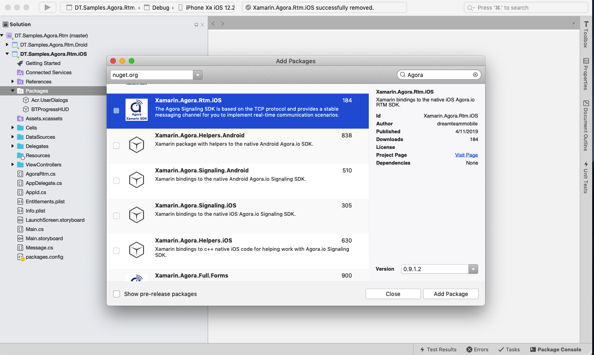
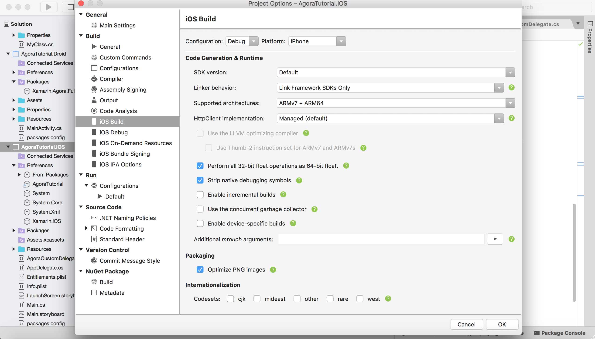

# Agora RTM Tutorial for Xamarin.iOS - 1 to 1

## Prerequisites
- [Xamarin iOS and Visual Studio](https://developer.xamarin.com/getting-started-ios/)
- Basic knowledge of C#
- Agora.io Developer Account

## Step 1. Agora.io Account
If you haven't already, [create an Agora.io developer account](https://www.dashboard.agora.io/signup). Once you finish the sign up process, you will be redirected to the Dashboard. Feel free to use the sample project's App ID for this tutorial.

## Step 2. Integrate the Agora SDK
Create a new Blank Native app Solution.







## Step 3. Add Agora Nuget packages to iOS project

For AgoraTutorial.iOS project add package [Xamarin.Agora.Rtm.iOS](https://www.nuget.org/packages/Xamarin.Agora.Rtm.iOS/)





## Step 4. Project properties

Verify the project properties build target is `Armv7 + AMD64`, the library does not support `Armv7s` as a target.



## Step 5. Add Agora Functionality

### Initialize Agora Rtm SDK
``` c#
using System;
using UIKit;

namespace DT.Samples.Agora.Rtm.iOS
{
    public partial class MainViewController : UIViewController
    {
        public static AgoraRtmKit RtmKit;
        private RtmDelegate _rtmDelegate;
        private ChannelDelegate _channelDelegate;
				
        public MainViewController (IntPtr ptr) : base (ptr) 
        {
        
        }
        
        public override void ViewDidLoad()
        {
            base.ViewDidLoad();
            InitializeAgoraRtm();
        }

        private void InitializeAgoraRtm()
        {
            _rtmDelegate = new RtmDelegate();
            _channelDelegate = new ChannelDelegate();
            _rtmDelegate.AppendMessage += AppendMsg;
            
            RtmKit = new AgoraRtmKit("Your-App-ID", _rtmDelegate);
        }
        
        public void AppendMsg(string user, string content)
        {
            InvokeOnMainThread(() =>
            {
                //Append message in UITableView
		//Need call this code in UI thread
            });
        }
    }
}
```
`AgoraRtmKit` is the basic interface class of Agora RTM SDK. The `AgoraRtmKit` object enables the use of Agora RTM SDK's communication functionality. Create a variable that is an `AgoraRtmKit` object make it an implicitly unwrapped optional. Next, create a method (`InitializeAgoraRtm()`) that will initialize the `AgoraRtmKit` class as a singleton instance to initialize the service before we use it. In the method call, supply two parameters: `AppId` and `delegate`. Provide your App ID as a String and your delegate for handle channel event. The Agora Native SDK uses delegates to inform the application on the engine runtime events (joining/leaving a channel, new participants, etc).  Call the `InitializeAgoraRtm()` method inside the `ViewDidLoad()` method. 

### Send peer-to-peer message
``` c#
public void SendPeer(string peer, string msg)
{
    var message = new AgoraRtmMessage(msg);

    RtmKit.SendMessage(message, peer, (state) =>
    {
        Console.WriteLine($"send peer msg state: ({state})");
        var current = AgoraRtm.Current;
        AppendMsg(current, msg);
    });
}
```
Create a method (`SendPeer()`) and using this method for send message to specific user.

### Join Channel

First need override delegate AgoraRtmChannelDelegate:

``` c#
public class ChannelDelegate : AgoraRtmChannelDelegate
{
    public Action<string, string> AppendMessage;
    public Action<AgoraRtmChannel, AgoraRtmMember> MemberJoined;
    public Action<AgoraRtmChannel, AgoraRtmMember> MemberLeft;

    public override void MemberJoined(AgoraRtmKit kit, AgoraRtmChannel channel, AgoraRtmMember member)
    {
        InvokeOnMainThread(() => MemberJoined(channel, member));
    }

    public override void MemberLeft(AgoraRtmKit kit, AgoraRtmChannel channel, AgoraRtmMember member)
    {
        InvokeOnMainThread(() => MemberLeft(channel, member));
    }

    public override void MessageReceived(AgoraRtmKit kit, AgoraRtmChannel channel, AgoraRtmMessage message, AgoraRtmMember member)
    {
        InvokeOnMainThread(() => AppendMessage(member.UserId, message.Text));
    }
}
```

Using this delegate in code for join channel and our method for complete join.

``` c#
void JoinChannel()
{
    _channelDelegate.AppendMessage += AppendMsg;

    var channel = RtmKit.CreateChannelWithId(channelName, _channelDelegate);

    if (channel == null)
        return;

    channel.JoinWithCompletion(JoinChannelBlock);
}

private void JoinChannelBlock(AgoraRtmJoinChannelErrorCode errorCode)
{
    if (errorCode == AgoraRtmJoinChannelErrorCode.Ok)
    {
        //Channel success join
    }
}
```

### Leave from Channel

For leave the channel you need to check there is this channel. And using our method for complete leaving

``` c#
public void LeaveChannel(string channelName)
{
    var rtmChannels = RtmKit.Channels;

    if (!(rtmChannels[channelName] is AgoraRtmChannel rtmChannel))
        return;

    rtmChannel.LeaveWithCompletion(LeaveChannelBlock);
}

private void LeaveChannelBlock(AgoraRtmLeaveChannelErrorCode errorCode)
{
    if (errorCode == AgoraRtmJoinChannelErrorCode.Ok)
    {
        //Channel leave success
    }
}
```

### Send message to Channel

Create method  `SendChannel` for send messag in specific channel. First need get channel by name from channel list. Next send message to obtained channel.

``` c#
public void SendChannel(string channel, string msg)
{
    var rtmChannels = RtmKit.Channels;

    if ((rtmChannels[channel] is AgoraRtmChannel rtmChannel))
    {
        var message = new AgoraRtmMessage(msg);

        rtmChannel.SendMessage(message, (state) =>
        {
            AppendMsg(current, msg);
        });
    }
}
```

### Leave and join user to Channel

Add for our delegate methods. And detect leave and join users.

``` c#
public void InitUserLeaveJoin(string channel)
{
    _channelDelegate.MemberLeft += MemberLeft;
    _channelDelegate.MemberJoined += MemberJoined;
}

public void MemberLeft(AgoraRtmChannel channel, AgoraRtmMember member)
{
    //Show the left user
}

public void MemberJoined(AgoraRtmChannel channel, AgoraRtmMember member)
{
    //Show the join user
}
```


## Conclusion
There you have it! It just took a few steps to get a video app up and running. If you have any questions, please feel free to reach out via [e-mail](mailto:videocalls@dreamteam-mobile.com).
